# Instructions as a flow chart #

This is document version 1, dated 2025-02-24.

The diagram is available in
[plain text](#plain-text-version- "flowchart in plain text") and
[mermaid format.](#mermaid-version- "flowchart using mermaid notation")
The mermaid version needs a plugin. `IntelliJ` should display an icon
in the gutter (by the line number near the start of the mermaid
diagram code) to install the mermaid plugin.

## Plain text version ##

Steps with deadlines have a thicker border.

```text
     --------------------------------------------
     | Read these instructions:                 |
     |   give yourself time to understand parts |
     |   that are initially uncertain           |
     --------|-----------------------------------
             |
            \|/
             |
     --------|----------------------------------------------
     | Look quickly through the entire list of challenges, |
     | making notes in challengeNotes.md as you go:        |
     |   what each challenge is,                           |
     |   how much you like it,                             |
     |   whether you could make someone else enjoy it      |
     --------|----------------------------------------------
             |
            \|/
             |
     --------|--------------------------------------------------
|--->| Go through the challenges in slightly more detail:      |
|    | think of two or more different basic ways of solving it |
|    --------|--------------------------------------------------
|            |
|           \|/
|            |
|    --------|--------------
|    | Choose a challenge: |
|    | write down why      |
|    --------|--------------
|            |
|           \|/
|            |
|    --------|---------------------------------------
|    | Think about different programming mechanisms |
|    --------|---------------------------------------
|            |
|           \|/
|            |
|        /---|----------------\
|  No   /        Could         \
|------/    you communicate     \
       \ this enthusiastically  /
        \    to a beginner?    /
         \---|----------------/
             |  Yes or maybe
            \|/
             |
     --------|-------------------------------------
     | Think about explaining both designs        |
     | in diagrams, in English, and in pseudocode |
     --------|-------------------------------------
             |
            \|/
             |
     --------|------------------------------
     | Pick a winning design               |
     | Ensure you have written down:       |
     |   why this challenge;               |
     |   what your beginners already know; |
     |   what they will learn;             |
     |   your two designs;                 |
     |   how you picked the winner         |
     --------|------------------------------
             |
            \|/
             |
     ========|=============================
     || Deadline 1                       ||
     || Submit the questionnaire saying: ||
     ||   which challenge                ||
     ||   which tutor                    ||
     ========|=============================
             |
            \|/
             |
     --------|----------------
     | Design your worksheet |
     --------|----------------
             |
            \|/
             |
     --------|------------------------------
     | Code your design in src/Design.java |
     --------|------------------------------
             |
            \|/
             |
     ========|====================================
     || Deadline 2                              ||
     || Submit your worksheet                   ||
     || as an IntelliJ project zip for feedback ||
     ========|====================================
            \|/
             |
     ========|=========================
     || Deadline 3                   ||
     || Attend the feedback tutorial ||
     ==================================
```

## Mermaid version ##

Steps with deadlines have a thicker border.

The theme can be:
- default
- neutral (for black and white documents that will be printed)
- dark
- forest (shades of green)
- base (the only theme that can be customised)

```mermaid
---
title: Inf1B Assignment 2 Instructions
---
%%{init: {"theme": "dark",
          "flowchart": {"htmlLabels": "false", "curve": "basis"}} }%%
flowchart TB
    ReadInstructions["Read these instructions:
    give yourself time to understand parts
    that are initially uncertain"]
    QuickLook["Look quickly through the entire list of challenges,
    making notes in challengeNotes.md as you go:
    what each challenge is,
    how much you like it,
    whether you could make someone else enjoy it"]
    MoreDetail["Go through the challenges in slightly more detail:
    think of two or more different basic ways of solving it"]
    ChooseChallenge["Choose a challenge:
    write down why"]
    Mechanisms["Think about different programming mechanisms"]
    Decide{"Could you
    communicate
    this enthusiastically
    to a beginner?"}
    Explain["Think about explaining both designs
    in diagrams,
    in English,
    and in pseudocode"]
    PickWinner["Pick a winning design
    Ensure you have written down:
    why this challenge;
    what your beginners already know;
    what they will learn;
    your two designs;
    how you picked the winner"]
    SubmitQuestionnaire["Deadline 1
    Submit the questionnaire saying
    which challenge
    which tutor"]
    DesignWorksheet["Design your worksheet"]
    CodeDesign["Code your design in src/Design.java"]
    SubmitWorksheetForFeedback["Deadline 2
    Submit your worksheet for feedback
    as an IntelliJ project zip"]
    AttendTutorial["Deadline 3
    Attend the feedback tutorial"]
    
    ReadInstructions-->QuickLook-->MoreDetail-->ChooseChallenge-->Mechanisms
    Mechanisms-->Decide
    Decide -- No --> MoreDetail
    Decide -- Yes or maybe --> Explain
    Explain-->PickWinner-->SubmitQuestionnaire-->DesignWorksheet-->CodeDesign
    CodeDesign-->SubmitWorksheetForFeedback-->AttendTutorial
    
    classDef hasDeadline stroke-width:4px;
    class SubmitQuestionnaire,SubmitWorksheetForFeedback,AttendTutorial,SubmitWorksheetForMarking hasDeadline;
```



<STYLE>
* { /* Don't leave any empty lines or IntelliJ might not render correctly */
  /* Text size */
  font-size:   1.1rem;
  /*font-size:   1.2rem;*/
  /* Zenburn dark theme */
  background-color: #2A252A;
  color:            #D5DAD5;
  /* One Dark theme */
  /*background-color: #282C34;
  color:            #ABB2BF;*/
  /* white-ish on dull blue-ish */
  /*background-color: DarkSlateGray;
    color:            AntiqueWhite;*/
  /* white on black */
  /*background-color: black;
  color: white;*/
  /* black on white */
  /*background-color: white;
  color: black;*/
  /* nearly black on bright yellow */
  /*background-color: #FFFFAA;
  color:            #080808;*/
  /* black on bright blue */  
  /*background-color: #99CCFF;
  color:            black;*/
}
body {
  /* width of the text column */
  width: 80%;
  /* line spacing */
  line-height: 180%;
  /*line-height: 200%;*/
  /* Font styles: */
  /* Default sans serif */
  /*font-family: sans-serif;*/
  /* Default serif */
  font-family: serif;
  /* Specific font with generic fall-back */
  /* font-family: "Calibri Light", sans-serif; */
  /*font-family: "OpenDyslexic", sans-serif;*/
}
pre,
code,
pre code {
  /* line spacing */
  line-height: 150%;
  /* Default monospace */
  font-family: monospace;
  /* Specific fixed-width font with generic fall-back */
  /*font-family: "Consolas", monospace;*/
  /*font-family: "OpenDyslexicMono", monospace;*/
}
ol,
ol ol,
ol ol ol { /* Nested lists all use decimal numbering */
  list-style-type: decimal;
}
em {
  /* if you want underlining instead of italics */
  /*font-style: normal;
  border-bottom-style: solid;
  border-bottom-width: 1px;
  padding-bottom:      2px;*/
  text-decoration-skip-ink: auto;
}
h2 { /* Put a horizontal line above major headings to assist screen viewing */
  border-top:  1px solid #D5DAD5;
  margin-top:  80px;
  padding-top: 20px;
  }
</STYLE>